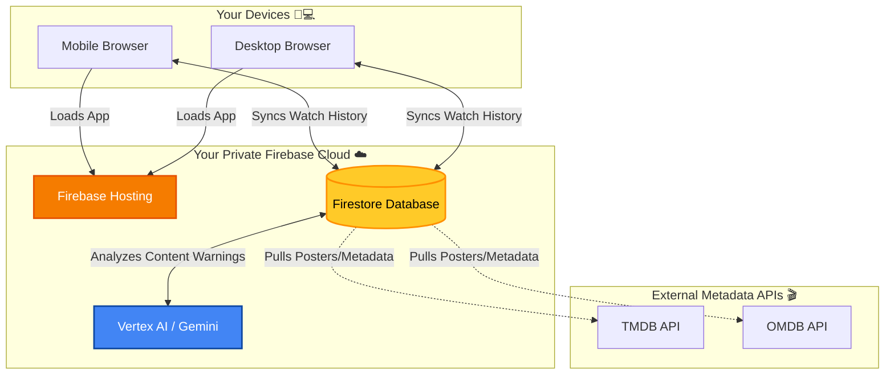

<div align="center">
  <h1>📺 TV-Timeless</h1>
  <p><strong>A passionate tribute and powerful replacement for the beloved TV-Time (RIP July 15, 2026).</strong></p>
</div>

For over a decade, TV-Time was the cozy digital home where millions of us meticulously tracked every binge-watch, shared our favorite moments, and agonized over character deaths. When the servers shut down on July 15, 2026, it felt like losing a piece of our television history. We lost our watchlists, our badges, and our timelines. 

**TV-Timeless** was built from the ashes for the refugees. It is a completely private, super-charged replacement that brings back the joy of tracking your favorite shows and movies without the corporate bloat. Whether you're seamlessly migrating your old GDPR data or starting fresh, TV-Timeless is your new, beautifully designed digital couch. Welcome home! 🛋️✨

---

## 🔒 100% Private. Your Data, Your Rules.

Let's get one thing straight: **I (the developer) have absolutely ZERO access to your data.** 

This application is built entirely on *your* private infrastructure. When you deploy TV-Timeless, it lives on your personal Google Firebase account. There are no tracking scripts, no hidden analytics, and no telemetry. It is just you, your movies, and your shows. 

*(Note: TV-Timeless is licensed under the permissive **Apache 2.0 License**, meaning it's free and open-source, but you are responsible for your own deployment and data.)*

---

## 📸 The Experience

*(Drop your awesome screenshots here!)*

### 📊 Dashboard & Tracking

*Keep an eye on what you're watching and see your cinematic stats come to life!*

### 🍿 Shows & Movies Libraries

*Your entire collection, beautifully organized with sleek glassmorphism design.*

### 🤖 The "Wokealyzer" (AI Mature Content Warnings)

*Powered by Gemini! Instantly scan shows for explicit/mature content before you watch with family.*

---

## 🏗️ How it Works (Deployment Architecture)

It’s surprisingly simple! Here is how your devices connect to your private tracker:



---

## 🚀 Getting Started (Chimp-Proof Guide 🦧)

Don't know how to code? Don't worry! Follow these steps and you'll have your own Netflix-style tracker up and running in 10 minutes.

### Step 1: Install Node.js
Go to [nodejs.org](https://nodejs.org/) and download the "LTS" (Long Term Support) installer for your OS (Windows, Mac, or Ubuntu/Linux). Run the installer and click "Next" until it's done.

### Step 2: Grab the Code
Open your computer's terminal:
- **Windows**: Press `Win + R`, type `cmd`, and hit Enter.
- **Mac**: Press `Cmd + Space`, type `Terminal`, and hit Enter.
- **Ubuntu/Linux**: Press `Ctrl + Alt + T`.

Run these commands to clone this project (make sure you have [Git](https://git-scm.com/downloads) installed!):
```bash
git clone https://github.com/cyber-coder-anon/tv-timeless.git
cd tv-timeless
npm install
```

### Step 3: Run the Intelligent Setup Wizard 🧙‍♂️
Run the following command to start the wizard. It will ask for your Firebase keys and API keys (which are all free to get) and automatically seed your database:
```bash
npm run setup
```

### Step 4: Deploy to the Web! 🌐
Once the wizard finishes and your data is uploaded, push it to your Firebase Hosting so you can access it on your phone:
```bash
npm run build
firebase deploy --only hosting
```
Boom! You're done! 🎉

---

> [!TIP]
> **🤖 WANT AN AI AGENT TO DO THIS FOR YOU?**
> If you have access to an agentic AI assistant (like Antigravity, Devin, or GitHub Copilot Workspaces), you can just copy/paste this prompt into the chat and let them handle the entire deployment!
> 
> ```text
> Hey Agent! I want to deploy this TV-Timeless repository. Please read the `AGENT_SETUP.md` file in the root directory for instructions on how to set up my Firebase environment and migrate my data.
> ```

---

## ⚠️ Disclaimer

**This software was created purely for personal, recreational use.** 

I, the developer, bear absolutely **no responsibility** for how this application is utilized once it leaves this repository. You control the deployment, the database, and the data. That being said, if you somehow manage to use a TV show tracking app for something devious or nefarious, you honestly deserve an award. 🏆 LMAO.

Stay out of trouble, and happy binging! 📺🍿
